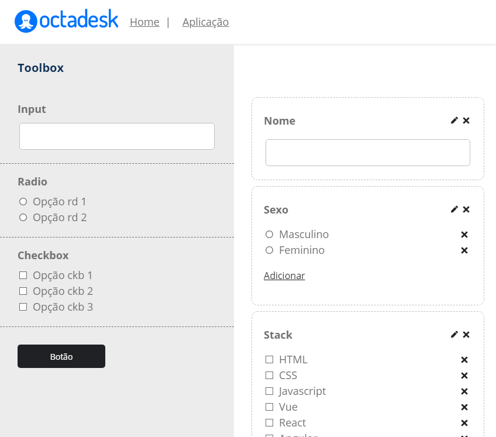

<br/>
<p align="center">
    
</p>

<p align="center">
    
</p>

<h1 align="center">Toolbox - Octadesk</h1>
Foi desenvolvido um Toolbox drag'n drop para criação de formulário dinâmicos. Onde o usuário poderá inserir quantos cards desejar e personalizar o título do card e gerenciar a lista excluindo e adicionado novos items.

<h2>Outras imagens</h2>
<p align="center">
    
    
    
</p>

<h1>Tecnologias:</h1>
- Vuex
- vuedraggable
- sortablejs


<h2>Rodando a Aplicação</h2>
#### Instale as dependências

```
$ npm install
```

#### Execute a Aplicação em Desenvolvimento

````
$ npm run serve
````

O servidor iniciará na porta:8080 - acesse http://localhost:8080


